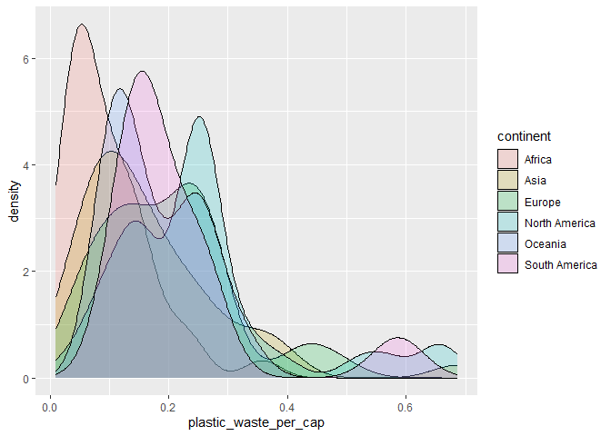
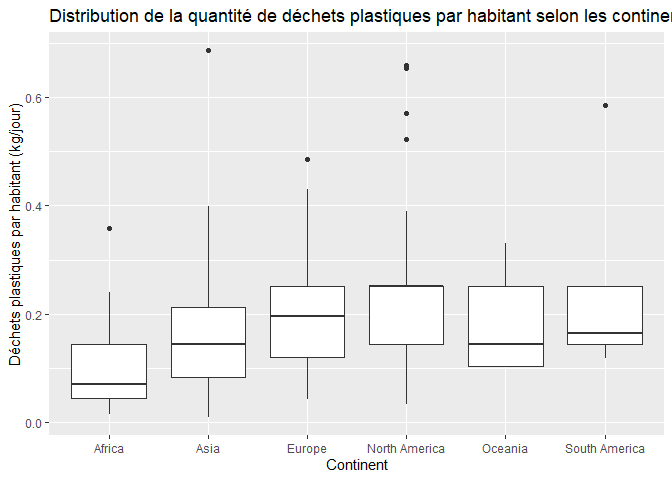
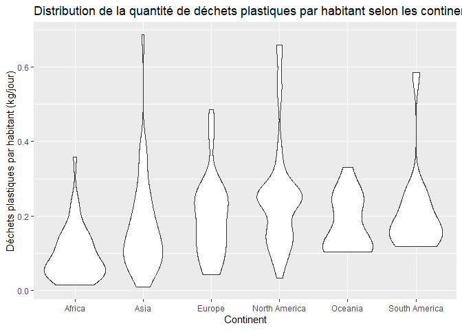
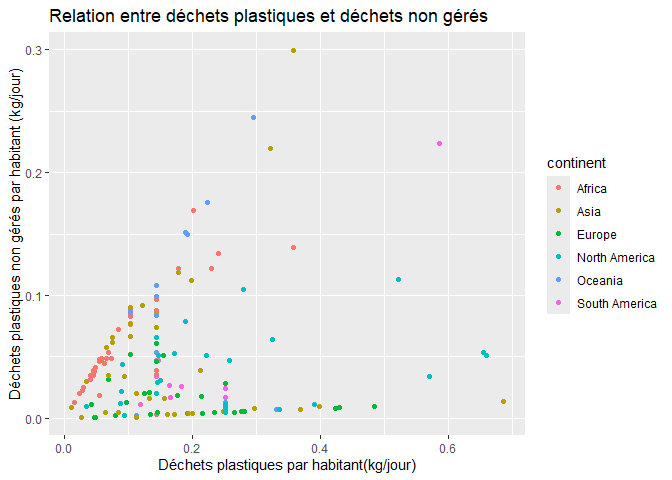
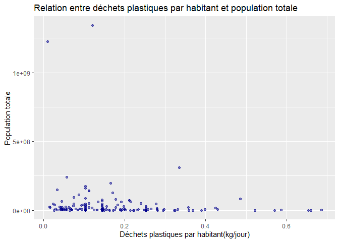
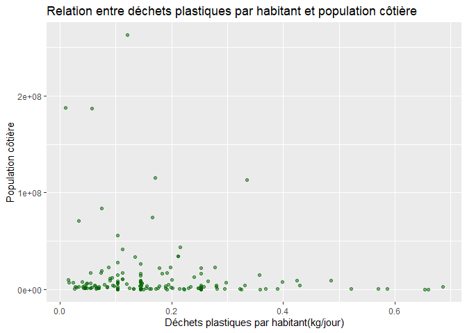

Lab 02 - Plastic waste
================
Alexandrine Parent
20 septembre 2025

## Chargement des packages et des données

``` r
library(tidyverse) 
```

``` r
plastic_waste <- read_csv("data/plastic-waste.csv")
```

Commençons par filtrer les données pour retirer le point représenté par
Trinité et Tobago (TTO) qui est un outlier.

``` r
plastic_waste <- plastic_waste %>%
  filter(plastic_waste_per_cap < 3.5)
```

## Exercices

### Exercise 1

L’Afrique et l’Asie ont une large distribution avec plusieurs pays ayant
des valeurs faibles à moyennes. L’Europe a une concentration autour
d’une valeur un peu plus élevée. L’Amérique du Nord et l’Océanie ont des
distributions un peu plus étroites, qui tournent autour de valeurs
basses à moyennes. L’Amérique du Sud possède moins de données (moins de
pays) avec des valeurs basses.

``` r
plastic_waste <- plastic_waste %>%
  filter(plastic_waste_per_cap < 3.5)
ggplot(plastic_waste, aes(x=plastic_waste_per_cap))+
  geom_histogram(binwidth = 0.2)+
  facet_wrap(~continent)+
  labs(title="Distribution de la quantité de déchets plastiques par habitant", x="Déchets plastiques par habitant (kg/jour)", y="Nombre de pays")
```

<!-- -->

### Exercise 2

``` r
plastic_waste <- plastic_waste %>%
  filter(plastic_waste_per_cap < 3.5)
ggplot(plastic_waste, aes(x=plastic_waste_per_cap, fill=continent)) +
  geom_density(alpha=0.2)
```

<!-- --> Le
réglage de la couleur (color et fill) et le réglage de la transparence
(alpha) ne se retrouvent pas au même endroit, car pour le réglage de la
couleur, on associe une variable du jeu de données (continent) à une
caractéristique visuelle du graphique. La couleur dépend donc de la
valeur d’une variable. Cependant, pour le réglage de la transparence,
alpha est un paramètre fixe, car on veut que chaque courbe ait le même
niveau de transparence.

### Exercise 3

Boxplot:

``` r
plastic_waste <- plastic_waste %>%
  filter(plastic_waste_per_cap < 3.5)
ggplot(plastic_waste, aes(x=continent, y=plastic_waste_per_cap)) +
  geom_boxplot()
```

<!-- -->

Violin plot:

``` r
plastic_waste <- plastic_waste %>%
  filter(plastic_waste_per_cap < 3.5)
ggplot(plastic_waste, aes(x=continent, y=plastic_waste_per_cap)) +
  geom_violin()
```

<!-- -->

Les violins plots permettent de voir la forme de la distribution tout au
long de l’axe verticale, alors que pour le boxplot, on ne voit pas la
forme globale. Les violins plots permettent également de voir combien de
données sont présentes à chaque niveau, si la forme est large, cela veut
dire qu’il y a beaucoup de données, et si la forme est fine, cela veut
dire qu’il y a peu de données, alors que pour le boxplot, toutes les
zones sont plates, donc on ne peut pas voir les endroits où les valeurs
sont les plus concentrées.

### Exercise 4

``` r
plastic_waste <- plastic_waste %>%
  filter(plastic_waste_per_cap < 3.5)
ggplot(plastic_waste, aes(x=plastic_waste_per_cap, y=mismanaged_plastic_waste_per_cap, color=continent))+
  geom_point()+
  labs(x="Déchets plastiques par habitant(kg/jour)", y="Déchets plastiques non gérés par habitant (kg/jour)", title="Relation entre déchets plastiques et déchets non gérés", color="continent")
```

<!-- -->

Le graphique de dispersion montre une relation positive, donc plus un
pays produit de déchets plastiques, plus il y a de déchets non gérés,
mais cela peut varier selon les continents. Par exemple, des pays d’Asie
ou d’Afrique font peu de déchets, mais ils gèrent mal la majorité de
ceux-ci. Pour les pays d’Europe ou d’Amérique du Nord, ils produisent
beaucoup de déchets, mais ils les gèrent bien.

### Exercise 5

``` r
plastic_waste <- plastic_waste %>%
  filter(plastic_waste_per_cap < 3.5)
ggplot(plastic_waste, aes(x=plastic_waste_per_cap, y=total_pop))+
  geom_point(alpha=0.5, color="darkblue")+
  labs(x="Déchets plastiques par habitant(kg/jour)", y="Population totale", title="Relation entre déchets plastiques par habitant et population totale")
```

    ## Warning: Removed 10 rows containing missing values or values outside the scale range
    ## (`geom_point()`).

<!-- -->

``` r
plastic_waste <- plastic_waste %>%
  filter(plastic_waste_per_cap < 3.5)
ggplot(plastic_waste, aes(x=plastic_waste_per_cap, y=coastal_pop))+
  geom_point(alpha=0.5, color="darkgreen")+
  labs(x="Déchets plastiques par habitant(kg/jour)", y="Population côtière", title="Relation entre déchets plastiques par habitant et population côtière")
```

<!-- -->

Au niveau des deux graphiques, il n’y a pas vraiment de relation plus
forte pour l’une des paires de variables. Les points sont assez
dispersés horizontalement et cela indique que la production de déchets
par habitant est relativement indépendante de la population.La
différence principale est seulement au niveau de l’échelle de la
population, qui est plus vaste au niveau de la population totale.

## Conclusion

Recréez la visualisation:

``` r
# insert code here
```
