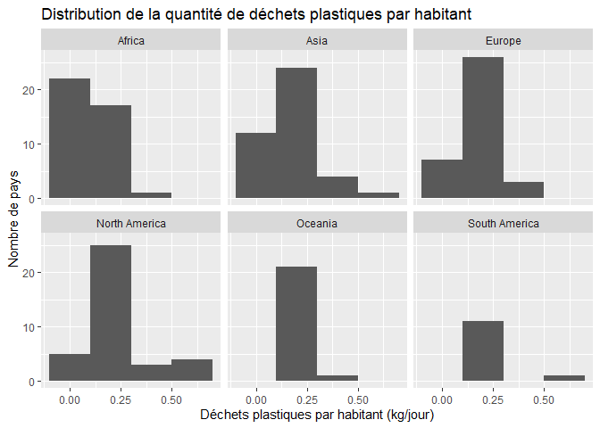

Lab 02 - Plastic waste
================
Alexandrine Parent
20 septembre 2025

## Chargement des packages et des données

``` r
library(tidyverse) 
```

``` r
plastic_waste <- read_csv("data/plastic-waste.csv")
```

Commençons par filtrer les données pour retirer le point représenté par
Trinité et Tobago (TTO) qui est un outlier.

``` r
plastic_waste <- plastic_waste %>%
  filter(plastic_waste_per_cap < 3.5)
```

## Exercices

### Exercise 1

L’Afrique et l’Asie ont une large distribution avec plusieurs pays ayant
des valeurs faibles à moyennes. L’Europe a une concentration autour
d’une valeur un peu plus élevée. L’Amérique du Nord et l’Océanie ont des
distributions un peu plus étroites, qui tournent autour de valeurs
basses à moyennes. L’Amérique du Sud possède moins de données (moins de
pays) avec des valeurs basses.

``` r
ggplot(plastic_waste, aes(x=plastic_waste_per_cap))+
  geom_histogram(binwidth = 0.2)+
  facet_wrap(~continent)+
  labs(title="Distribution de la quantité de déchets plastiques par habitant", x="Déchets plastiques par habitant (kg/jour)", y="Nombre de pays")
```

<!-- -->

### Exercise 2

``` r
# insert code here
```

Réponse à la question…

### Exercise 3

Boxplot:

``` r
# insert code here
```

Violin plot:

``` r
# insert code here
```

Réponse à la question…

### Exercise 4

``` r
# insert code here
```

Réponse à la question…

### Exercise 5

``` r
# insert code here
```

``` r
# insert code here
```

Réponse à la question…

## Conclusion

Recréez la visualisation:

``` r
# insert code here
```
